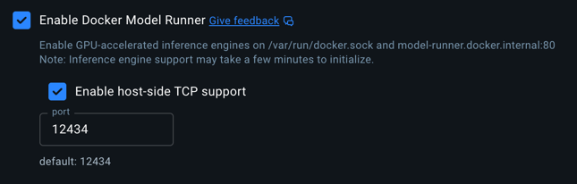

# 🔍 LLM Secret Scanner

> AI-powered security scanner that detects secrets, API keys, and sensitive data in source code using local Large Language Models.

[](https://opensource.org/licenses/MIT)
[](https://github.com/cyclingbits/llm-secret-scanner)
[](https://github.com/cyclingbits/llm-secret-scanner)
[](https://openjdk.java.net/)
[](https://kotlinlang.org/)
[](https://maven.apache.org/)

## ✨ Features

- 🤖 **AI-Powered Analysis** - Uses local LLM models via Docker Model Runner
- 🔒 **Privacy-First** - All analysis happens locally, no data leaves your machine
- 🎯 **Smart Detection** - Identifies API keys, passwords, certificates, database credentials, and more
- 🧠 **Adaptability** - Can detect unusual secret patterns that would escape traditional regex-based scanners
- 🚀 **Maven Integration** - Seamlessly integrates with your build pipeline
- ⚙️ **Highly Configurable** - Flexible file patterns, model selection, and timeout settings
- 🐳 **Containerized** - Automatic Docker container lifecycle management
- 🎨 **Beautiful Output** - Colorful, structured logging with emojis and clear issue reporting

## 📋 Requirements

- ☕ **Java 17+**
- 📦 **Maven 3.6+**
- 🐳 **Docker Desktop** (4.40+ Mac, 4.41+ Windows) with Model Runner enabled
  - You need to enable Docker Model Runner in Docker Desktop settings:
  - 
- 🌐 **Internet Connection**: Required for automatic download of selected LLM models

## 🚀 Quick Start

### 1. Installation

First, build and install the plugin locally:

```bash
git clone https://github.com/cyclingbits/llm-secret-scanner.git
cd llm-secret-scanner
mvn clean install
```

### 2. Add to Your Project

Add the plugin to your `pom.xml` (minimal configuration):

```xml
<plugin>
    <groupId>net.cyclingbits</groupId>
    <artifactId>llm-secret-scanner-maven-plugin</artifactId>
    <version>1.1.0</version>
</plugin>
```

### 3. Run the Scanner

```bash
mvn llm-secret-scanner:scan
```

## 🧠 Supported AI Models

The scanner supports various LLM models via [Docker Model Runner](https://hub.docker.com/u/ai). Below are performance benchmarks from our evaluation tests:

| Model | Detection Rate | Scan Success | Analysis Time | Parameters | Context Window | Size | Best For                                      |
|-------|----------------|--------------|---------------|------------|----------------|------|-----------------------------------------------|
| `ai/llama3.3:latest` | **82.7%** | 100% | 17m 26s | 70B | 131K tokens | 39.59 GB | Highest accuracy                              |
| `ai/phi4:latest` ⭐ | **74.3%** | 100% | 3m 50s | 15B | 16K tokens | 8.43 GB | **Default choice**                            |
| `ai/llama3.2:latest` | **70.4%** | 100% | 1m 20s | 3B | 131K tokens | 1.87 GB | Fast & lightweight                            |
| `ai/deepcoder-preview:latest` | **69.3%** | 100% | 11m 15s | 14B | 131K tokens | 8.37 GB | -                                             |
| `ai/mistral-nemo:latest` | **65.7%** | 100% | 3m 5s | 12B | 131K tokens | 6.96 GB | -                                             |
| `ai/llama3.1:latest` | **64.8%** | 100% | 2m 1s | 8B | 131K tokens | 4.58 GB | -                                             |
| `ai/qwq:latest` | **64.3%** | 52.9% | 88m 22s | 32B | 41K tokens | 18.48 GB | JSON generation errors and model API timeouts |
| `ai/qwen3:latest` | **64.2%** | 76.5% | 21m 51s | 8B | 41K tokens | 4.68 GB | JSON generation errors                        |
| `ai/qwen2.5:latest` | **60.5%** | 94.1% | 1m 49s | 7B | 33K tokens | 4.36 GB | JSON generation errors                        |
| `ai/gemma3:latest` | **56.4%** | 100% | 1m 43s | 4B | 131K tokens | 2.31 GB | -                                             |
| `ai/gemma3-qat:latest` | **55.3%** | 100% | 1m 41s | 3.88B | 131K tokens | 2.93 GB | -                                             |
| `ai/deepseek-r1-distill-llama:latest` | **54.1%** | 100% | 4m 51s | 8B | 131K tokens | 4.58 GB | -                                             |
| `ai/mistral:latest` | **52.5%** | 100% | 2m 10s | 7B | 33K tokens | 4.07 GB | -                                             |
| `ai/smollm2:latest` | **0.0%** | 0% | 9m 44s | 360M | 8K tokens | 256.35 MB | JSON generation errors                        |

> 📊 **Performance data** based on analysis of test fixtures with known vulnerabilities. All models available from [Docker Hub AI](https://hub.docker.com/u/ai).
> 
> **Detection Rate** indicates the percentage of known security issues correctly identified by the model (with line number accuracy verification ±1).  
> **Scan Success** indicates the percentage of files that were successfully analyzed without errors (e.g., timeouts, JSON parsing failures).

## 📖 Usage Examples

### Basic Scan
```bash
mvn llm-secret-scanner:scan
```

### Custom Model
```bash
mvn llm-secret-scanner:scan -Dscan.modelName=ai/gemma3:4B-Q4_K_M
```

### Fail Build on Issues
```bash
mvn llm-secret-scanner:scan -Dscan.failOnError=true
```

### Custom Source Directory
```bash
mvn llm-secret-scanner:scan -Dscan.sourceDirectory=./custom-src
```

## ⚙️ Advanced Configuration

For more control, you can customize the plugin configuration:

```xml
<plugin>
    <groupId>net.cyclingbits</groupId>
    <artifactId>llm-secret-scanner-maven-plugin</artifactId>
    <version>1.1.0</version>
    <configuration>
        <sourceDirectory>${project.basedir}/src</sourceDirectory>
        <includes>**/*.java,**/*.kt,**/*.properties,**/*.yml,**/*.env</includes>
        <excludes>**/target/**,**/test/**</excludes>
        <modelName>ai/phi4:latest</modelName>
        <systemPrompt>Find API keys and secrets in the provided code</systemPrompt>
        <failOnError>false</failOnError>
        <fileAnalysisTimeout>60</fileAnalysisTimeout>
        <maxTokens>10000</maxTokens>
        <temperature>0.0</temperature>
        <maxFileSizeBytes>102400</maxFileSizeBytes>
    </configuration>
    <executions>
        <execution>
            <goals>
                <goal>scan</goal>
            </goals>
            <phase>verify</phase>
        </execution>
    </executions>
</plugin>
```

### Configuration Parameters

| Parameter | Default | Description |
|-----------|---------|-------------|
| `sourceDirectory` | `${project.basedir}` | Directory to scan |
| `includes` | `**/*.java,**/*.kt,...` | File patterns to include |
| `excludes` | `**/target/**` | File patterns to exclude |
| `modelName` | `ai/phi4:latest` | LLM model to use |
| `systemPrompt` | _null_ | Custom system prompt (optional) |
| `failOnError` | `false` | Fail build when issues found |
| `fileAnalysisTimeout` | `60` | File analysis timeout (seconds) |
| `maxTokens` | `10000` | Maximum tokens per request |
| `temperature` | `0.0` | LLM temperature (0.0-2.0) |
| `maxFileSizeBytes` | `102400` | Maximum file size (100KB) |

## 📊 Sample Output

```
🔍 Starting LLM Secret Scanner with configuration:
       📄 Source directory: /project/src
       🐳 Model: ai/gemma3:latest
       ⏱️ File analysis timeout: 60s
       ✅ Include patterns: **/*.java
       ❌ Exclude patterns: **/target/**

📄 Found 1 files matching patterns
🐳 Starting Docker container
✅ Docker container started successfully
🔍 Starting analysis of 1 files

Found 12 issues in file: Example_15.java (analyzed in 11.7s)
       🚨 #1 | Line 9 | Password | Hardcoded password 'simple_password_123!' in a private field.
       🚨 #2 | Line 13 | API Key | API key 'api-key-xyz-789-abc' in a public constant.
       🚨 #3 | Line 18 | Token | Token 'token-from-char-array' stored in a character array.
       🚨 #4 | Line 26 | Private Key | PEM encoded RSA private key with sensitive material.
       🚨 #5 | Line 37 | Database Credentials | Database connection string with credentials.
       🚨 #6 | Line 44 | Password | Password 'temp_debug_password' in a single-line comment.
       🚨 #7 | Line 55 | API Key | API token 'deprecated_token_in_annotation' in an annotation.
       🚨 #8 | Line 68 | Token | Token 'auth_token_from_map_value' stored in a map.
       🚨 #9 | Line 76 | Password | Secret parts combined to form a complete secret.
       🚨 #10 | Line 91 | Password | Complex password with special characters.
       🚨 #11 | Line 99 | Private Key | Base64 encoded string likely represents a key or secret.
       🚨 #12 | Line 107 | Secret | Static variable likely holds a secret value.

✅ Scan completed successfully. Found 12 total issues in 13.6s
```

## 🏗️ Architecture

This project consists of three modules:

- **🔧 core** - Core scanning engine and Docker container management
- **📦 maven-plugin** - Maven plugin integration for build pipelines  
- **📈 evaluator** - Performance benchmarking tools for testing LLM models

## 🛠️ Development

### Build from Source
```bash
git clone https://github.com/cyclingbits/llm-secret-scanner.git
cd llm-secret-scanner
mvn clean compile
```

### Run Tests
```bash
mvn test
```

### Run Evaluator

Quick evaluation (Java files only, single model):
```bash
cd evaluator
mvn exec:java -Dexec.mainClass="net.cyclingbits.llmsecretscanner.evaluator.QuickEvaluator"
```

Full evaluation (all file types, all models):
```bash
cd evaluator
mvn exec:java -Dexec.mainClass="net.cyclingbits.llmsecretscanner.evaluator.FullEvaluator"
```

## 🚨 What It Detects

The LLM scanner is trained to identify various types of sensitive information:

- 🔑 **API Keys** - AWS, Google Cloud, Azure, GitHub, etc.
- 🔐 **Passwords** - Hardcoded passwords in source code
- 🗄️ **Database Credentials** - Connection strings with embedded credentials
- 🔏 **Private Keys** - RSA, ECDSA, SSH private keys, certificates
- 🎟️ **Tokens** - JWT tokens, session tokens, auth tokens
- 🔒 **Secrets** - Generic secrets and high-entropy strings
- 📧 **Email Credentials** - SMTP passwords and configurations

## 🛡️ Security & Privacy

- **Local Processing**: All analysis happens on your machine - no data is sent to external services
- **Docker Isolation**: LLM models run in isolated Docker containers
- **Zero Data Persistence**: Scanner doesn't store or cache your source code, ensuring maximum security and privacy
- **Memory Safe**: Containers are automatically cleaned up after scanning

## ⚠️ Limitations

- Requires Docker Desktop with Model Runner feature
- Analysis speed depends on model size and file count
- False positives possible (manually review results)
- Only supports files encodable in UTF-8


## 📄 License

This project is licensed under the MIT License - see the [LICENSE](LICENSE) file for details.

## 📝 Changelog

All notable changes to this project are documented in the [CHANGELOG.md](CHANGELOG.md) file.

## 📞 Contact

For questions, feedback, or support, please reach out to us at:
📧 **CyclingBitsAI@gmail.com**

## 🙏 Acknowledgments

- [Docker Model Runner](https://docs.docker.com/desktop/model-runner/) for local AI model execution
- [TestContainers](https://testcontainers.org/) for Docker integration testing
- [Kotlin](https://kotlinlang.org/) for the beautiful, concise codebase
- [Maven](https://maven.apache.org/) for build management

---

Made with ❤️ by [Cycling Bits](https://cyclingbits.net)
