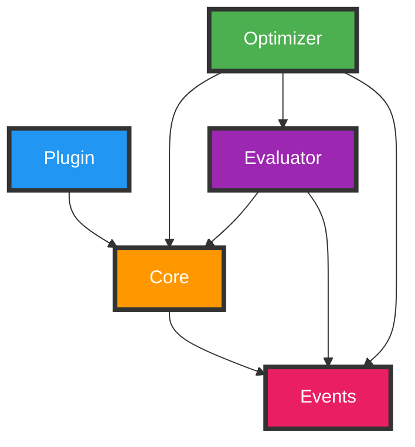
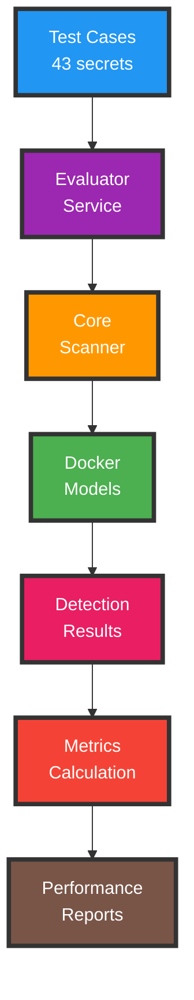
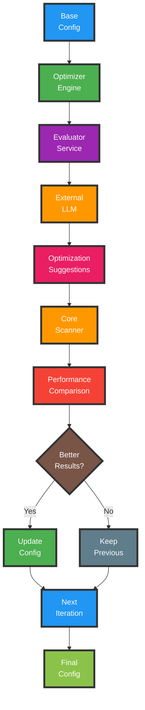

# 🔍 LLM Secret Scanner

> AI-powered security scanner that detects secrets, API keys, and sensitive data in source code using local Large Language Models.

[](https://opensource.org/licenses/MIT)
[](CHANGELOG.md)
[](https://github.com/cyclingbits/llm-secret-scanner)
[](https://github.com/cyclingbits/llm-secret-scanner)
[](https://openjdk.java.net/)
[](https://kotlinlang.org/)
[](https://maven.apache.org/)

## ✨ Features

- 🤖 **AI-Powered Analysis** - Uses local LLM models via Docker Model Runner
- 🔒 **Privacy-First** - All analysis happens locally, no data leaves your machine
- 🎯 **Smart Detection** - Identifies API keys, passwords, certificates, database credentials, and more
- 🧠 **Adaptability** - Can detect unusual secret patterns that would escape traditional regex-based scanners
- 📄 **File Chunking** - Advanced chunking system for analyzing large files with overlapping context preservation
- 🚀 **Maven Integration** - Seamlessly integrates with your build pipeline
- ⚙️ **Highly Configurable** - Flexible file patterns, model selection, and timeout settings
- 🐳 **Containerized** - Automatic Docker container lifecycle management
- 🎨 **Beautiful Output** - Colorful, structured logging with emojis and clear issue reporting
- 🔍 **False Positive Reduction** - Enhanced accuracy with sophisticated issue deduplication

## 📋 Requirements

- ☕ **Java 17+**
- 📦 **Maven 3.6+**
- 🐳 **Docker Desktop** (4.40+ Mac, 4.41+ Windows) with Model Runner enabled
  - You need to enable Docker Model Runner in Docker Desktop settings:
  - 
- 🌐 **Internet Connection**: Required for automatic download of selected LLM models

## 🚀 Quick Start

### 1. Installation

You can install the plugin using one of these methods:

#### Option A: Use GitHub Packages Repository
Add the GitHub Packages plugin repository to your `pom.xml`:

```xml
<pluginRepositories>
    <pluginRepository>
        <id>github</id>
        <url>https://maven.pkg.github.com/cyclingbits/llm-secret-scanner</url>
    </pluginRepository>
</pluginRepositories>
```

You'll also need to authenticate with GitHub Packages. Add to your `~/.m2/settings.xml`:
```xml
<servers>
    <server>
        <id>github</id>
        <username>YOUR_GITHUB_USERNAME</username>
        <password>YOUR_GITHUB_TOKEN</password>
    </server>
</servers>
```

#### Option B: Download from GitHub Releases (Recommended)
```bash
# Download the latest release JARs
wget https://github.com/cyclingbits/llm-secret-scanner/releases/latest/download/llm-secret-scanner-maven-plugin-1.3.0.jar
# Install to local Maven repository
mvn install:install-file -Dfile=llm-secret-scanner-maven-plugin-1.3.0.jar -DgroupId=net.cyclingbits -DartifactId=llm-secret-scanner-maven-plugin -Dversion=1.3.0 -Dpackaging=jar
```

#### Option C: Build from Source
```bash
git clone https://github.com/cyclingbits/llm-secret-scanner.git
cd llm-secret-scanner
mvn clean install
```

### 2. Add to Your Project

Add the plugin to your `pom.xml` (minimal configuration):

```xml
<plugin>
    <groupId>net.cyclingbits</groupId>
    <artifactId>llm-secret-scanner-maven-plugin</artifactId>
    <version>1.3.0</version>
</plugin>
```

### 3. Run the Scanner

```bash
mvn llm-secret-scanner:scan
```

## 🧠 Supported AI Models

The scanner supports various LLM models via [Docker Model Runner](https://hub.docker.com/u/ai). The recommended model is **`ai/phi4:latest`**, which provides the best scanning results with low execution time.

### 📊 **Evaluation Results**

| LLM Image | Detection<br>Rate | False Positive<br>Rate | Time | Parameters | Context<br>Window | Size |
|-----------|----------------|---------------------|------|------------|----------------|------|
| ai/phi4:latest | 74.9% | 0.4% | 5m 27s | 15B | 16K tokens | 8.43 GB |

The evaluation was conducted on test files from the `test_cases` directory, which included: Java, Kotlin, Properties, XML, and YAML files.

**`ai/phi4:latest`** is the recommended model for most use cases, offering excellent detection accuracy with very low false positive rate while maintaining reasonable scanning time. This 15B parameter model strikes the perfect balance between performance and accuracy.

## 📖 Usage Examples

### Basic Scan
```bash
mvn llm-secret-scanner:scan
```

### Custom Model
```bash
mvn llm-secret-scanner:scan -Dscan.modelName=ai/llama3.2:latest
```

### Fail Build on Issues
```bash
mvn llm-secret-scanner:scan -Dscan.failOnError=true
```

### Multiple Source Directories
```xml
<configuration>
    <sourceDirectories>
        <sourceDirectory>${project.basedir}/src/main</sourceDirectory>
        <sourceDirectory>${project.basedir}/src/test</sourceDirectory>
        <sourceDirectory>${project.basedir}/config</sourceDirectory>
    </sourceDirectories>
</configuration>
```

## ⚙️ Advanced Configuration

For more control, you can customize the plugin configuration:

```xml
<plugin>
    <groupId>net.cyclingbits</groupId>
    <artifactId>llm-secret-scanner-maven-plugin</artifactId>
    <version>1.3.0</version>
    <configuration>
        <sourceDirectories>
            <sourceDirectory>${project.basedir}/src/main</sourceDirectory>
            <sourceDirectory>${project.basedir}/src/test</sourceDirectory>
            <sourceDirectory>${project.basedir}/config</sourceDirectory>
        </sourceDirectories>
        <includes>**/*.java,**/*.kt,**/*.xml,**/*.properties,**/*.yml,**/*.yaml,**/*.json,**/*.md,**/*.sql,**/*.gradle,**/*.kts,**/*.env,**/*.sh,**/*.bat,**/*.html,**/*.css,**/*.js,**/*.ts,**/*.dockerfile</includes>
        <excludes>**/target/**</excludes>
        <modelName>ai/phi4:latest</modelName>
        <systemPrompt>Find API keys and secrets in the provided code</systemPrompt>
        <failOnError>false</failOnError>
        <chunkAnalysisTimeout>60</chunkAnalysisTimeout>
        <maxTokens>16000</maxTokens>
        <temperature>0.0</temperature>
        <dockerImage>alpine/socat:1.7.4.3-r0</dockerImage>
        <maxFileSizeBytes>102400</maxFileSizeBytes>
        <enableChunking>true</enableChunking>
        <maxLinesPerChunk>40</maxLinesPerChunk>
        <chunkOverlapLines>5</chunkOverlapLines>
    </configuration>
    <executions>
        <execution>
            <goals>
                <goal>scan</goal>
            </goals>
            <phase>verify</phase>
        </execution>
    </executions>
</plugin>
```

### Configuration Parameters

| Parameter | Default | Description |
|-----------|---------|-------------|
| `sourceDirectories` | `${project.basedir}` | List of directories to scan |
| `includes` | `**/*.java,**/*.kt,**/*.xml,**/*.properties,**/*.yml,**/*.yaml,**/*.json,**/*.md,**/*.sql,**/*.gradle,**/*.kts,**/*.env,**/*.sh,**/*.bat,**/*.html,**/*.css,**/*.js,**/*.ts,**/*.dockerfile` | File patterns to include |
| `excludes` | `**/target/**` | File patterns to exclude |
| `modelName` | `ai/phi4:latest` | LLM model to use |
| `systemPrompt` | _null_ | Custom system prompt (optional) |
| `failOnError` | `false` | Fail build when issues found |
| `chunkAnalysisTimeout` | `60` | Chunk analysis timeout (seconds) |
| `maxTokens` | `16000` | Maximum tokens per request |
| `temperature` | `0.0` | LLM temperature (0.0-2.0) |
| `dockerImage` | `alpine/socat:1.7.4.3-r0` | Docker proxy image for container communication |
| `maxFileSizeBytes` | `102400` | Maximum file size (100KB) |
| `enableChunking` | `true` | Enable file chunking for large files |
| `maxLinesPerChunk` | `40` | Maximum lines per chunk |
| `chunkOverlapLines` | `5` | Lines overlap between chunks |

## 📊 Sample Output

```
🔍 Starting LLM Secret Scanner with configuration:
       📄 Source directory: /fixtures
       🐳 Model: ai/llama3.2:latest
       ⏱️ Chunk analysis timeout: 60s
       ✅ Include patterns: **/*.java
       ❌ Exclude patterns: **/target/**

📄 Found 1 files matching patterns
🐳 Starting Docker container...
✅ Docker container started successfully
🔍 Starting analysis of 1 files

[1/1] Analyzing file example.java...
       Found 13 issues (analyzed in 14,9s)
       🚨 #1 | Line 12 | Password | Hardcoded password
       🚨 #2 | Line 14 | API Key | Hardcoded API key
       🚨 #3 | Line 16 | Base64 Encoded Secret | Base64 encoded secret
       🚨 #4 | Line 20 | Private Key | Hardcoded private key
       🚨 #5 | Line 31 | Database Connection String | Hardcoded database connection string
       🚨 #6 | Line 33 | Password | Hardcoded password
       🚨 #7 | Line 52 | Token | Hardcoded token
       🚨 #8 | Line 54 | Token | Hardcoded token
       🚨 #9 | Line 62 | Password | Hardcoded password
       🚨 #10 | Line 64 | Password | Hardcoded password
       🚨 #11 | Line 67 | Base64 Encoded Secret | Base64 encoded secret
       🚨 #12 | Line 68 | Base64 Encoded Secret | Base64 encoded secret
       🚨 #13 | Line 70 | Static Secret | Hardcoded static secret

✅ Scan completed successfully. Analyzed 1 of 1 files, found 13 total issues in 14,9s
```

## 🏗️ Architecture

This project consists of five modules with three distinct usage patterns:

### 📦 Modules

- **📊 events** - Event-driven logging and observability system with thread-safe event storage
- **🔧 core** - Core scanning engine with file chunking, Docker container management, and issue deduplication
- **📦 maven-plugin** - Maven plugin integration for build pipelines
- **📈 evaluator** - Performance benchmarking tools with comprehensive model evaluation
- **🎯 optimizer** - AI-powered configuration optimization using external LLMs (OpenAI, Anthropic, Google)

### 🔄 Module Dependencies



### 🚀 Three Usage Patterns

#### 1. 🔧 Standard Usage - Maven Plugin
**Use Case**: Integrate secret scanning into your build pipeline


**Flow**:
1. Maven plugin reads project configuration
2. Core scanner discovers files using configured patterns
3. Files are chunked for optimal LLM processing
4. Docker containers are managed automatically
5. Local LLM analyzes code chunks for secrets
6. Issues are deduplicated and reported with colorized output

```bash
mvn llm-secret-scanner:scan
```

#### 2. 📊 Evaluator - Model Performance Testing
**Use Case**: Test and compare different local LLM models for secret detection accuracy



**Flow**:
1. Evaluator loads test cases with known secrets
2. Multiple LLM models are tested systematically
3. Each model's detection accuracy is measured
4. Performance metrics are calculated and compared
5. Comprehensive reports are generated for model selection

```bash
# Quick evaluation (single model, Java files)
mvn exec:java -Dexec.mainClass="net.cyclingbits.llmsecretscanner.evaluator.QuickEvaluation" -pl evaluator

# Full evaluation (all models, all file types)
mvn exec:java -Dexec.mainClass="net.cyclingbits.llmsecretscanner.evaluator.FullEvaluation" -pl evaluator
```

#### 3. 🎯 Optimizer - AI-Powered Configuration Tuning
**Use Case**: Automatically optimize system prompts for specific file types and local models using external LLMs



**Flow**:
1. Optimizer starts with baseline configuration
2. Current performance is evaluated using test cases
3. External LLM analyzes results and suggests improvements
4. New system prompt is tested with local model
5. Performance is compared with previous iteration
6. Best configuration is selected and process repeats
7. Final optimized configuration is saved

```bash
# Run optimization with Anthropic Claude
export ANTHROPIC_API_KEY="your-key"
mvn exec:java -Dexec.mainClass="net.cyclingbits.llmsecretscanner.optimizer.QuickOptimization" -pl optimizer
```

### 🔍 Information Flow Summary

- **Events Module**: Provides centralized logging and observability across all components
- **Core Module**: Central scanning engine used by all three usage patterns
- **Maven Plugin**: Wraps core functionality for build integration
- **Evaluator**: Uses core for systematic model testing and performance measurement
- **Optimizer**: Combines evaluator and external LLMs for automated configuration improvement

## 🛠️ Development

### Build from Source
```bash
git clone https://github.com/cyclingbits/llm-secret-scanner.git
cd llm-secret-scanner
mvn clean compile
```

### Run Tests
```bash
mvn test
```

### Run Evaluator

Quick evaluation (Java files only, single model):
```bash
cd evaluator
mvn exec:java -Dexec.mainClass="net.cyclingbits.llmsecretscanner.evaluator.QuickEvaluation"
```

Full evaluation (all file types, all models):
```bash
cd evaluator
mvn exec:java -Dexec.mainClass="net.cyclingbits.llmsecretscanner.evaluator.FullEvaluation"
```

The evaluator now includes comprehensive metrics:
- **Detection Rate**: Percentage of known vulnerabilities correctly identified
- **False Positive Rate**: Percentage of clean code incorrectly flagged as vulnerable  
- **Scan Success Rate**: Percentage of files successfully analyzed without errors
- **Performance Timing**: Analysis time for each model

## 🚨 What It Detects

The LLM scanner is trained to identify various types of sensitive information:

- 🔑 **API Keys** - AWS, Google Cloud, Azure, GitHub, etc.
- 🔐 **Passwords** - Hardcoded passwords in source code
- 🗄️ **Database Credentials** - Connection strings with embedded credentials
- 🔏 **Private Keys** - RSA, ECDSA, SSH private keys, certificates
- 🎟️ **Tokens** - JWT tokens, session tokens, auth tokens
- 🔒 **Secrets** - Generic secrets and high-entropy strings
- 📧 **Email Credentials** - SMTP passwords and configurations

## 🛡️ Security & Privacy

- **Local Processing**: All analysis happens on your machine - no data is sent to external services
- **Docker Isolation**: LLM models run in isolated Docker containers
- **Zero Data Persistence**: Scanner doesn't store or cache your source code, ensuring maximum security and privacy
- **Memory Safe**: Containers are automatically cleaned up after scanning

## ⚠️ Limitations

- Requires Docker Desktop with Model Runner feature
- Analysis speed depends on model size and file count
- False positives possible (manually review results)
- Only supports files encodable in UTF-8


## 📄 License

This project is licensed under the MIT License - see the [LICENSE](LICENSE) file for details.

## 📝 Changelog

All notable changes to this project are documented in the [CHANGELOG.md](CHANGELOG.md) file.

## 📞 Contact

For questions, feedback, or support, please reach out to us at:
📧 **CyclingBitsAI@gmail.com**

## 🙏 Acknowledgments

- [Docker Model Runner](https://docs.docker.com/desktop/model-runner/) for local AI model execution
- [TestContainers](https://testcontainers.org/) for Docker integration testing
- [Kotlin](https://kotlinlang.org/) for the beautiful, concise codebase
- [Maven](https://maven.apache.org/) for build management

---

Made with ❤️ by [Cycling Bits](https://github.com/CyclingBits)
